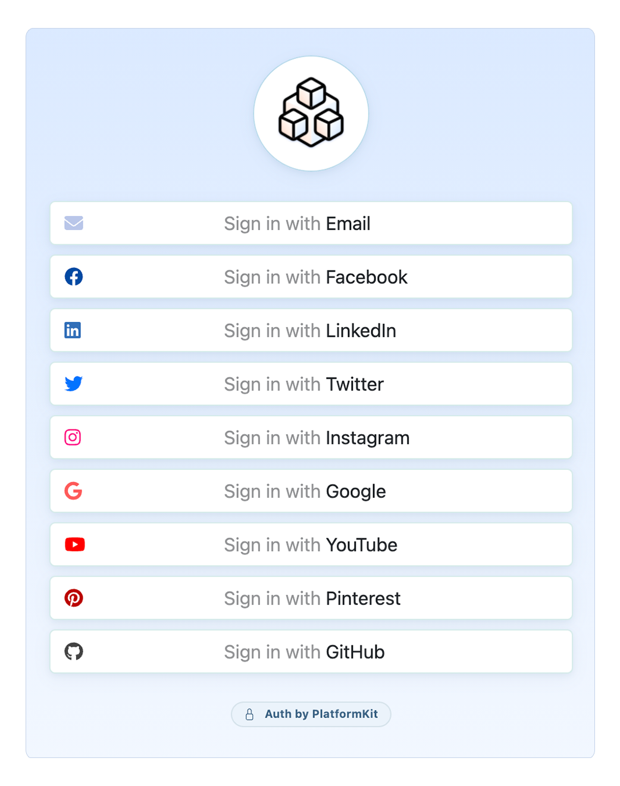

<h1 align="center">PlatformKit Auth</h1>

<p align="center">
Open-Source, Self-Hosted, Standalone Authentication/Single Sign-On (SSO) Solution
</p>

**Connects with:** <br>

<p float="left">


</p>

**Works with:** <br>
<p float="left">


</p>

**Built with:** <br>

<p float="left">


</p>

**Deploy with:** <br> 
<p float="left">
  
</p>

**License:** <br> 

<div align="center">
    
</div>

## Features

- Single Sign-On & passwordless login for any app or framework
- Beautiful, minimal UI included out of the box
- UI can be easily customized
- Additional SSO platforms can be easily added

## Local Development

Clone the project

```bash
  git clone https://github.com/platform-kit/auth pk-auth
```

Go to the project directory

```bash
  cd pk-auth
```

Install dependencies

```bash
  npm install
```

Start the server

```bash
  npm run dev
```

A local instance is now running at `https://localhost:3000`

## Configuration

Before use, you will need to add the following environment variables to your .env file

```env
# Environment
ENVIRONMENT=development
SESSION_SECRET=xxxxx

# Branding
LOGO=https://www.example.com/logo.png

# Repository for custom UI/Routes
REPO=https://www.github.com/{username}/{repo}
BUILD_COMMAND="npm run build"
UI_DIRECTORY="dist"
ROUTES_DIRECTORY="routes"
DEV_PATH=localhost:4000

# Redirects
ALLOWED_DOMAINS=https://localhost:4000,https://localhost:3000

# E-mail
MAGIC_LINK_SECRET=xxxxx
MAIL_USER=user@example.com
MAIL_SENDER=user@example.com
MAIL_KEY=password
MAIL_HOST=smtp.xxx.xxx
MAIL_PORT=587

# Facebook
FACEBOOK_CLIENT_ID=
FACEBOOK_APP_SECRET=
FACEBOOK_SCOPES=email,pages_show_list,pages_read_engagement,instagram_content_publish,instagram_basic,pages_show_list

# Twitter
TWITTER_APP_ID=
TWITTER_CONSUMER_API_KEY=
TWITTER_CONSUMER_API_SECRET=

# Google
GOOGLE_CLIENT_ID=
GOOGLE_CLIENT_SECRET=

# Pinterest 
PINTEREST_APP_ID=
PINTEREST_APP_SECRET=
PINTEREST_SCOPES=user_accounts:read,pins:read,pins:write,boards:write,boards:read

# GitHub
GITHUB_CLIENT_ID=
GITHUB_CLIENT_SECRET=
```

## Integrating with your app / website

Embed the app in an iframe within your website/app. The end-user will go through the login flow entirely through the embedded endpoint. If the login is successful, the user will be redirected to a `/succcess` endpoint where the `token` and a `secret` are represented as the `t` and `s` URL query parameters.

Example:

```
https://localhost:3000/success?t=abcdefg&s=1234567
```

Using the Javascript framework/method of your choice, you can monitor the iframe for the presence of this information, and scrape it/close the iframe accordingly when it appears.

## Deployment

To deploy to the cloud, simply click one of the buttons below.

<a href="https://render.com/deploy?repo=https://github.com/platform-kit/auth" target="_blank">  </a> <a href="https://heroku.com/deploy?template=https://github.com/platform-kit/auth" target="_blank"></a> <a href="https://cloud.digitalocean.com/apps/new?repo=https://github.com/platform-kit/auth/tree/main" target="_blank"> </a>
